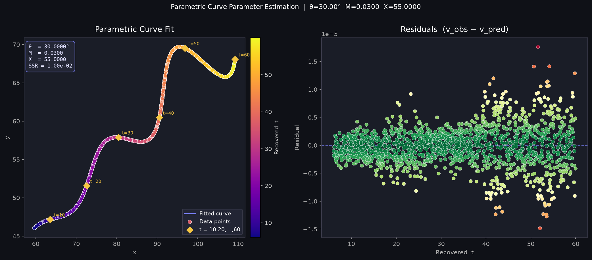
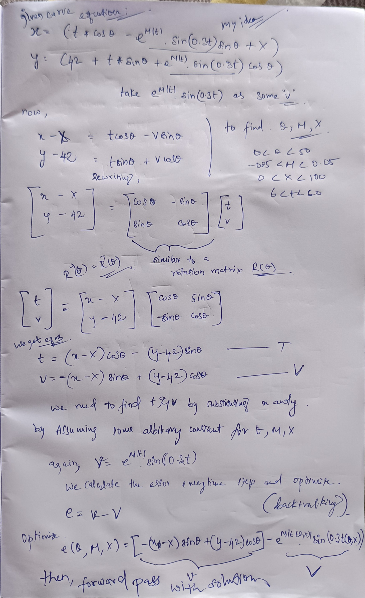

# Parametric Curve Parameter Estimation

## Final Answer

- **θ** = 30° (0.5236 rad)
- **M** = 0.03
- **X** = 55

**Desmos / LaTeX submission string:**
```
"\left(t*\cos(0.5236)-e^{0.03\left|t\right|}\cdot\sin(0.3t)\sin(0.5236)\
+55,42+\
t*\sin(0.5236)+e^{0.03\left|t\right|}\cdot\sin(0.3t)\cos(0.5236)\right)"
```



## Approach



The two given equations can be rewritten as a 2D rotation matrix applied to a base signal. 

```
x - X  = t*cos(θ) - v*sin(θ)
y - 42 = t*sin(θ) + v*cos(θ)      

where v = e^(M|t|)*sin(0.3t)
```

In matrix form:
```
[x-X ]   [cos θ   -sin θ] [t]
[y-42] = [sin θ    cos θ] [v]
```

Since rotation matrices are orthogonal, the inverse is just the transpose. This means for any guess of (θ, X), we can directly recover the `t` and `v` values for every point in the dataset without searching:

```
t = (x-X)*cos(θ) + (y-42)*sin(θ)
v_obs = -(x-X)*sin(θ) + (y-42)*cos(θ)
```

The recovered `v_obs` must equal the model's prediction `v_pred = e^(M*t)*sin(0.3t)`. The difference between them is our residual error.

This turns the problem into a standard bound-constrained nonlinear least-squares optimization problem:
Minimize the sum of `(v_obs - v_pred)^2` by tuning θ, M, and X within their given bounds.

## Implementation

I wrote a Python script (`solve_curve_params.py`) to solve this. 

1. **Global Search**: First, it does a coarse grid search over the allowed ranges for θ, M, and X to avoid getting stuck in local minima (which happen frequently because of the sine and exponential terms).
2. **Local Refinement**: It takes the best guess from the grid search and uses `scipy.optimize.least_squares` (with Trust Region Reflective bounds) to refine the parameters to high precision.

### How to run the code:
```bash
pip install numpy pandas scipy matplotlib
python solve_curve_params.py
```
*(Make sure `xy_data.csv` is in the same folder)*
